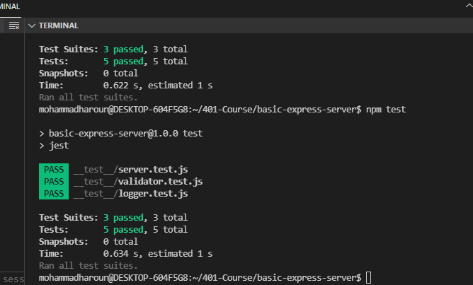
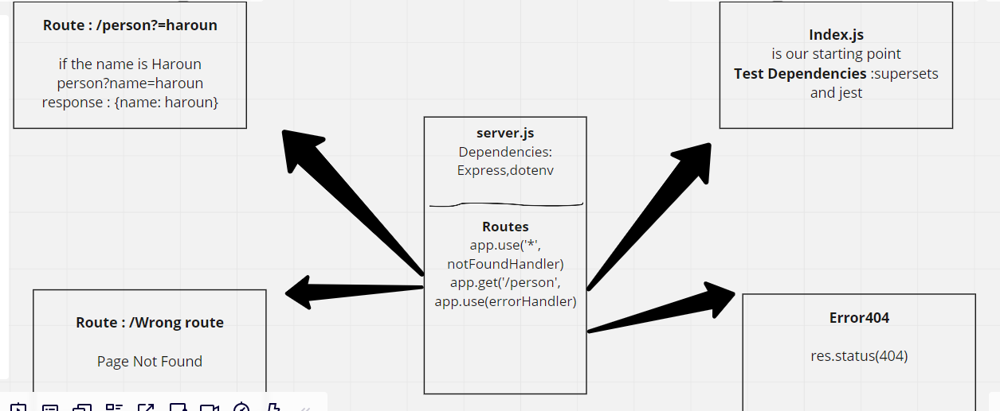

# Basic-express-server
## Author: Mohammad Haroun
just press on them 
[Deployment Link (Heroku) ](https://basic-express-server-haroun.herokuapp.com/person?name=haroun)

[Deployment Link (Heroku)(page Not Found 404 situation) ](https://basic-express-server-haroun.herokuapp.com/fooo)
[Test Report Link ](https://github.com/Mohammad-Haroun-97/basic-express-server/actions)
[Pull request Link ](https://github.com/Mohammad-Haroun-97/basic-express-server/pulls?q=is%3Apr+is%3Aclosed)
# Setup
.env requirements
PORT - Port Number

# Running the app
npm start

# Tests
Unit Tests: npm run test
## locally test working

# Working Diagram 

